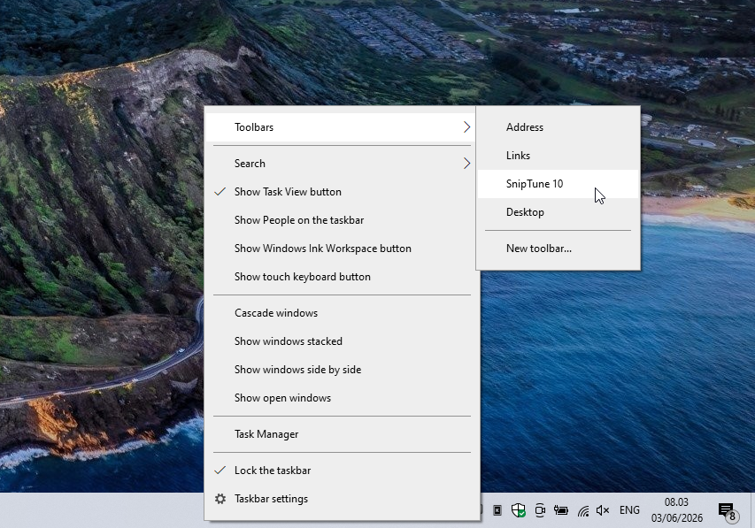
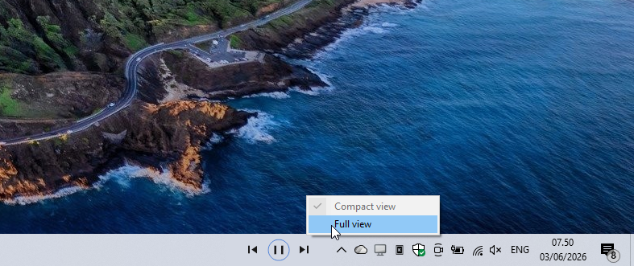
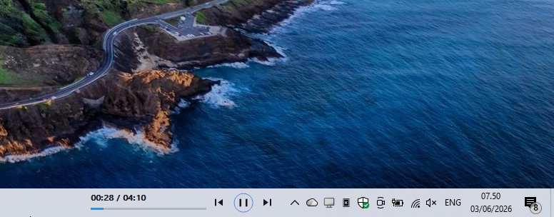

# SnipTune 10

SnipTune 10 is a native Windows 10 taskbar music widget by [SnipGeek](https://snipgeek.com). It adds compact media controls directly to the taskbar through the classic Windows DeskBand toolbar system.



## Install

For most users, use the installer from GitHub Releases:

1. Open [SnipTune 10 releases](https://github.com/ieproject-app/widget-music/releases).
2. Download `SnipTune10Setup-1.0.5-x64.exe`.
3. Run the installer on Windows 10 x64.
4. Right click an empty area of the taskbar.
5. Choose `Toolbars` > `SnipTune 10`.
6. If Windows asks for confirmation, choose `Yes`.

The installer registers the DeskBand, restarts Explorer for the current user session, and installs a per-user prewarm helper so the first activation after login feels faster. It does not auto-enable the toolbar because Windows can show a confirmation dialog.

## Preview

Compact mode:



Full mode with progress:



Demo video: [preview/demo-vidio-widget.mp4](preview/demo-vidio-widget.mp4)

## Features

* Native Windows 10 taskbar DeskBand, not an overlay.
* Compact and full modes from the widget right-click menu.
* Previous, play/pause, and next controls.
* Full mode progress text and display-only progress bar.
* Native-looking taskbar background sampling.
* Faster first activation with per-user host prewarm.
* Keyboard support: `Left`, `Right`, `Enter`, and `Space`.
* Screen reader support through MSAA virtual buttons.
* Per-user installer and uninstall flow.

## Requirements

* Windows 10 x64.
* Windows taskbar toolbar support enabled by the OS.
* A media app that exposes Windows media sessions, such as Spotify, Chrome/Edge media playback, Media Player, or compatible players.

Windows 11 is not currently a supported target because classic taskbar DeskBands are not a stable public path there.

## Troubleshooting

If `SnipTune 10` does not appear in the taskbar Toolbars menu, restart Explorer or open the Toolbars menu again after install. Some Windows 10 systems need the menu opened twice after registration.

If the widget appears but shows `Disconnected`, confirm `WidgetMusicHost.exe` is installed next to `WidgetMusicDeskband.dll`. For release installs, reinstalling the latest setup file is usually the simplest repair.

Debug logs can be read from:

* `%TEMP%\WidgetMusicDeskband.log`
* `%TEMP%\WidgetMusicHost.log`

Debug logging is off by default. It can be enabled with `HKCU\Software\WidgetMusic\DebugLog` as a DWORD value of `1`.

## Update And Uninstall

To update, run the newer `SnipTune10Setup-<version>-x64.exe`. The installer keeps the same AppId, unregisters the old DeskBand, updates files in `%LOCALAPPDATA%\SnipGeek\SnipTune 10`, registers the new version, and restarts Explorer for the current user session.

To uninstall, use Apps & Features or Control Panel. Uninstall unregisters the DeskBand, removes the prewarm startup entry, stops the host for the current session, and restarts Explorer.

## Build From Source

Prerequisites:

* Visual Studio Build Tools 2022 or later with Desktop development with C++.
* Windows 10 SDK.
* Inno Setup 6, only if you want to build the `.exe` installer.

Build x64 Release:

```bat
.\scripts\Build.cmd Release
```

Run lightweight tests:

```bat
.\scripts\Run-WidgetMusicTests.cmd Release
```

Create the runtime package:

```bat
.\scripts\Package-WidgetMusic.cmd Release
```

Create the installer:

```bat
.\scripts\Build-Installer.cmd Release
```

The installer output is:

```text
out\dist\SnipTune10Setup-1.0.5-x64.exe
```

For development registration:

```bat
.\scripts\Register-WidgetMusic.cmd Release restart
```

Then enable it manually from `Right click taskbar` > `Toolbars` > `SnipTune 10`.

## Contributing

Bug reports and pull requests are welcome. Please read [CONTRIBUTING.md](CONTRIBUTING.md) before opening a PR.

For security-sensitive reports, please follow [SECURITY.md](SECURITY.md) instead of opening a public issue.

## Links

* Website: [snipgeek.com](https://snipgeek.com)
* GitHub: [github.com/ieproject-app/widget-music](https://github.com/ieproject-app/widget-music)
* License: [MIT](LICENSE)
