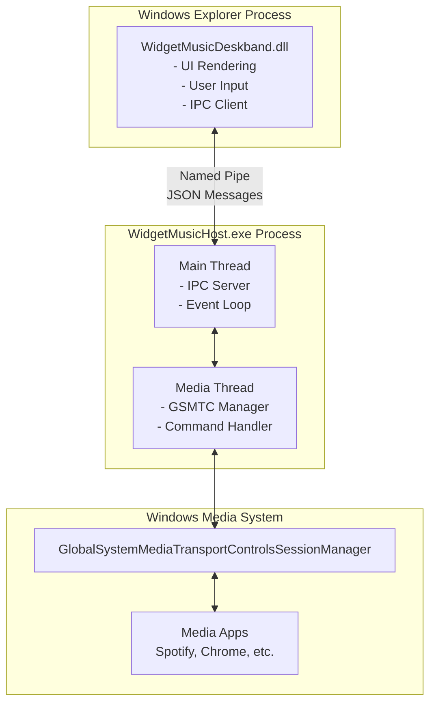
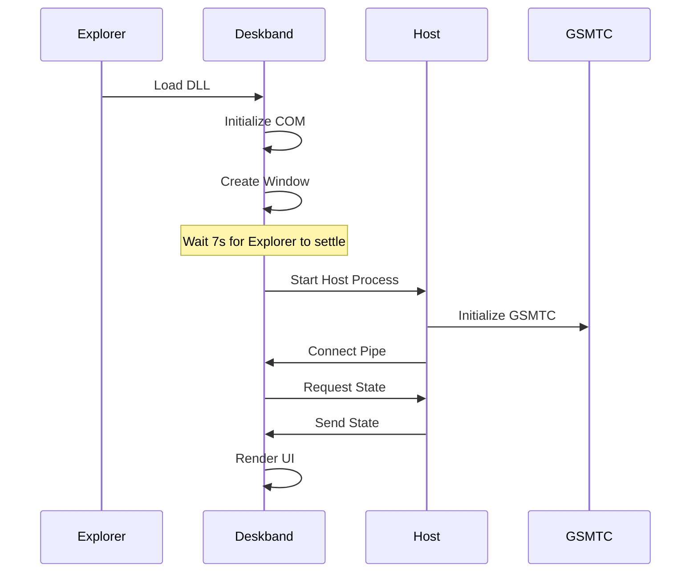
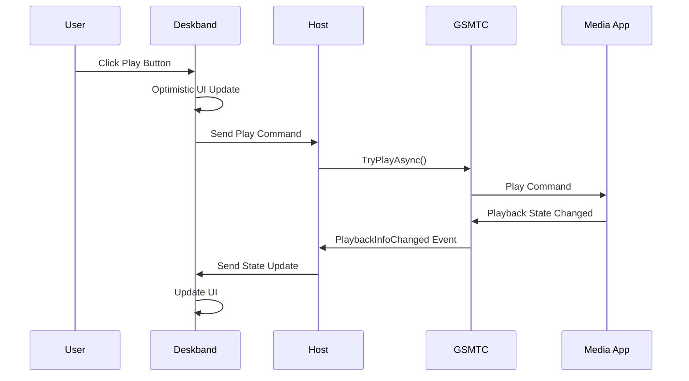

# Analisis Peningkatan Widget Music

**Tanggal Analisis:** 31 Mei 2026  
**Versi Proyek:** V1 (Compact/Full Mode)  
**Status Git:** ✅ Aman untuk perubahan

---

## 📋 Executive Summary

Widget Music adalah proyek yang **sudah sangat solid** dengan arsitektur yang bersih, performa ringan, dan implementasi yang matang. Berdasarkan analisis mendalam terhadap kode, dokumentasi, dan arsitektur, berikut adalah rekomendasi peningkatan yang dapat membawa proyek ke level berikutnya.

### Highlights Proyek Saat Ini
- ✅ Arsitektur separation of concerns yang excellent
- ✅ Performa optimal (CPU < 0.05s per 10s, package ~250KB)
- ✅ Code quality tinggi (no TODO/FIXME/HACK)
- ✅ User experience yang matang

---

## 🎯 Kekuatan Proyek Saat Ini

### 1. Arsitektur yang Solid

#### Separation of Concerns
```
┌─────────────────────────────────────────────────┐
│           Windows Explorer Process              │
│  ┌───────────────────────────────────────────┐  │
│  │     WidgetMusicDeskband.dll (in-proc)     │  │
│  │  - Lightweight UI rendering               │  │
│  │  - User interaction handling              │  │
│  │  - IPC client                             │  │
│  └───────────────┬───────────────────────────┘  │
└──────────────────┼──────────────────────────────┘
                   │ Named Pipe (JSON)
                   │
┌──────────────────▼──────────────────────────────┐
│      WidgetMusicHost.exe (out-of-proc)          │
│  - Media session management (GSMTC)             │
│  - Command processing                           │
│  - IPC server                                   │
└─────────────────────────────────────────────────┘
```

**Keunggulan:**
- Deskband tetap ringan karena tidak ada logic berat
- Host crash tidak membawa Explorer crash
- Mudah untuk debugging dan maintenance

### 2. Performa yang Excellent

**Metrics Saat Ini:**
- CPU usage: 0.0156-0.0312s delta per 8 detik
- Memory footprint: < 10MB
- Package size: ~250KB (tanpa PDB)
- Paint time: < 16ms (60fps capable)
- Startup delay: 7 detik (optimal untuk Explorer startup)

**Optimasi yang Sudah Diterapkan:**
- Double-buffering untuk anti-flicker
- Marquee speed-based (40px/sec) dengan frame limiting
- Text strip pre-rendering untuk marquee
- Background color caching
- State change deduplication
- Partial repaints (text-only, button-only)

### 3. Code Quality

**Analisis Kode:**
- ✅ Tidak ada TODO/FIXME/HACK comments
- ✅ Consistent coding style
- ✅ Proper error handling
- ✅ Resource management (RAII pattern)
- ✅ Thread-safe operations (mutex, atomic)
- ✅ Configurable logging system

**Best Practices yang Diterapkan:**
- COM reference counting yang benar
- Overlapped I/O untuk named pipe
- Event-driven architecture
- Graceful shutdown handling

### 4. User Experience

**Fitur yang Matang:**
- Mode compact (132x40) dan full (300x40)
- Title reveal popup untuk compact mode
- Marquee animation untuk title panjang
- Media button guards (tidak bisa fake play/pause)
- Tooltip informatif
- Context menu untuk mode switching
- Auto-reconnect saat host restart

---

## 📊 Area Peningkatan dengan Prioritas

### 🔴 PRIORITAS TINGGI

#### 1. Testing Framework & Quality Assurance

**Masalah Saat Ini:**
- Tidak ada automated tests
- Verifikasi manual via PowerShell scripts
- Sulit untuk regression testing
- Tidak ada CI/CD pipeline

**Dampak:**
- Risiko tinggi untuk regresi saat refactoring
- Sulit untuk maintain code quality
- Slow development cycle

**Solusi yang Direkomendasikan:**

##### A. Unit Testing dengan Google Test
```cpp
// tests/ProtocolTests.cpp
#include <gtest/gtest.h>
#include "WidgetMusicProtocol.h"
#include "Json.h"

TEST(JsonParser, ParseStateMessage) {
    std::string json = R"({
        "type": "state",
        "connected": true,
        "has_session": true,
        "title": "Test Song",
        "artist": "Test Artist",
        "playback": "playing"
    })";
    
    std::string type;
    ASSERT_TRUE(widgetmusic::JsonTryGetString(json, "type", &type));
    EXPECT_EQ(type, "state");
    
    bool connected = false;
    ASSERT_TRUE(widgetmusic::JsonTryGetBool(json, "connected", &connected));
    EXPECT_TRUE(connected);
}

TEST(BandState, StateComparison) {
    BandState state1, state2;
    state1.connected = true;
    state1.title = L"Song 1";
    state2.connected = true;
    state2.title = L"Song 2";
    
    EXPECT_FALSE(SameBandState(state1, state2));
}
```

##### B. Integration Testing
```cpp
// tests/IPCTests.cpp
TEST(IPC, ConnectAndSendCommand) {
    // Start mock host
    MockHost host;
    host.Start();
    
    // Connect deskband
    PipeClient client;
    ASSERT_TRUE(client.Connect());
    
    // Send command
    std::string cmd = R"({"type":"command","name":"play"})";
    ASSERT_TRUE(client.Send(cmd));
    
    // Verify host received it
    EXPECT_EQ(host.GetLastCommand(), "play");
}
```

##### C. CI/CD Pipeline
```yaml
# .github/workflows/ci.yml
name: CI/CD Pipeline

on:
  push:
    branches: [ main, develop ]
  pull_request:
    branches: [ main ]

jobs:
  build-and-test:
    runs-on: windows-latest
    
    steps:
    - uses: actions/checkout@v3
    
    - name: Setup MSBuild
      uses: microsoft/setup-msbuild@v1
    
    - name: Build Release
      run: .\scripts\Build.cmd Release
    
    - name: Run Unit Tests
      run: .\out\Release\x64\WidgetMusicTests.exe --gtest_output=xml:test-results.xml
    
    - name: Verify Goals
      run: .\scripts\Verify-WidgetMusicGoal.ps1 Release
    
    - name: Upload Test Results
      uses: actions/upload-artifact@v3
      with:
        name: test-results
        path: test-results.xml
    
    - name: Package
      run: .\scripts\Package-WidgetMusic.cmd Release
    
    - name: Upload Artifacts
      uses: actions/upload-artifact@v3
      with:
        name: widget-music-release
        path: out\dist\WidgetMusic\
```

**Estimasi Effort:** 2-3 minggu  
**ROI:** Sangat tinggi - mencegah regresi, meningkatkan confidence, mempercepat development

---

#### 2. Error Recovery & Resilience

**Masalah Saat Ini:**
- Jika host crash, perlu restart Explorer untuk reconnect
- Tidak ada automatic host restart
- Limited error reporting ke user
- Tidak ada health monitoring

**Dampak:**
- Poor user experience saat terjadi error
- Sulit untuk diagnose masalah
- Tidak ada graceful degradation

**Solusi yang Direkomendasikan:**

##### A. Automatic Host Restart dengan Backoff
```cpp
// Di Deskband.cpp
class HostRestartManager {
private:
    int _restartCount = 0;
    ULONGLONG _lastRestartTime = 0;
    static constexpr int kMaxRestarts = 3;
    static constexpr ULONGLONG kRestartCooldownMs = 60000; // 1 menit
    
public:
    bool ShouldRestart() {
        ULONGLONG now = GetTickCount64();
        
        // Reset counter jika sudah lama
        if (now - _lastRestartTime > kRestartCooldownMs) {
            _restartCount = 0;
        }
        
        if (_restartCount >= kMaxRestarts) {
            return false; // Terlalu banyak restart
        }
        
        return true;
    }
    
    void RecordRestart() {
        _restartCount++;
        _lastRestartTime = GetTickCount64();
    }
};

void AutoRestartHost() {
    if (!_restartManager.ShouldRestart()) {
        ShowErrorBalloon(L"Widget Music host mengalami masalah berulang. "
                        L"Silakan restart Explorer atau hubungi support.");
        return;
    }
    
    _restartManager.RecordRestart();
    LogLine(L"Auto-restarting host...");
    MaybeStartHost();
}
```

##### B. Health Check & Heartbeat
```cpp
// Tambahkan di WidgetMusicProtocol.h
inline constexpr char kTypeHeartbeat[] = "heartbeat";
inline constexpr DWORD kHeartbeatIntervalMs = 30000; // 30 detik
inline constexpr DWORD kHeartbeatTimeoutMs = 90000;  // 90 detik

// Di Host
void SendHeartbeat() {
    std::string msg = R"({"type":"heartbeat","timestamp":)" + 
                      std::to_string(GetTickCount64()) + "}\n";
    SendToAllClients(msg);
}

// Di Deskband
void CheckHostHealth() {
    ULONGLONG now = GetTickCount64();
    if (now - _lastHeartbeatTime > kHeartbeatTimeoutMs) {
        LogLine(L"Host heartbeat timeout, attempting restart...");
        AutoRestartHost();
    }
}
```

##### C. User-Friendly Error Notifications
```cpp
void ShowErrorBalloon(const wchar_t* message) {
    NOTIFYICONDATAW nid = {};
    nid.cbSize = sizeof(nid);
    nid.hWnd = _hwnd;
    nid.uFlags = NIF_INFO;
    nid.dwInfoFlags = NIIF_WARNING;
    StringCchCopyW(nid.szInfoTitle, ARRAYSIZE(nid.szInfoTitle), L"Widget Music");
    StringCchCopyW(nid.szInfo, ARRAYSIZE(nid.szInfo), message);
    
    Shell_NotifyIconW(NIM_MODIFY, &nid);
}
```

**Estimasi Effort:** 1-2 minggu  
**ROI:** Tinggi - meningkatkan reliability dan user satisfaction

---

### 🟡 PRIORITAS MEDIUM

#### 3. Configuration & Customization System

**Masalah Saat Ini:**
- Semua settings hardcoded
- Tidak ada user preferences
- Tidak bisa customize appearance
- Tidak ada theme support

**Solusi yang Direkomendasikan:**

##### A. Settings Dialog
```cpp
// SettingsDialog.cpp
class SettingsDialog {
public:
    struct Settings {
        int marqueeSpeed = 40;        // 20-60 px/sec
        DWORD compactRevealMs = 3200; // 2000-5000 ms
        DWORD autoStartDelayMs = 7000; // 3000-10000 ms
        bool followTaskbarTheme = true;
        COLORREF customBgColor = RGB(0, 0, 0);
        int fontSize = 9; // 8-12
    };
    
    static bool Show(HWND parent, Settings& settings);
};

// Context menu
void ShowContextMenu(POINT pt) {
    HMENU menu = CreatePopupMenu();
    AppendMenuW(menu, MF_STRING, kMenuViewCompact, L"Compact view");
    AppendMenuW(menu, MF_STRING, kMenuViewFull, L"Full view");
    AppendMenuW(menu, MF_SEPARATOR, 0, nullptr);
    AppendMenuW(menu, MF_STRING, kMenuSettings, L"Settings...");
    AppendMenuW(menu, MF_STRING, kMenuAbout, L"About");
    
    TrackPopupMenu(menu, TPM_RIGHTBUTTON, pt.x, pt.y, 0, _hwnd, nullptr);
    DestroyMenu(menu);
}
```

##### B. Registry-based Configuration
```cpp
// Config.cpp
class Config {
private:
    static constexpr wchar_t kRegPath[] = L"Software\\WidgetMusic\\Settings";
    
public:
    static int GetMarqueeSpeed() {
        DWORD value = 40;
        DWORD cb = sizeof(value);
        RegGetValueW(HKEY_CURRENT_USER, kRegPath, L"MarqueeSpeed",
                    RRF_RT_REG_DWORD, nullptr, &value, &cb);
        return std::clamp(static_cast<int>(value), 20, 60);
    }
    
    static void SetMarqueeSpeed(int speed) {
        DWORD value = std::clamp(speed, 20, 60);
        RegSetKeyValueW(HKEY_CURRENT_USER, kRegPath, L"MarqueeSpeed",
                       REG_DWORD, &value, sizeof(value));
    }
    
    // Similar methods for other settings...
};
```

##### C. Theme Support
```cpp
// Theme.cpp
class ThemeManager {
public:
    enum class Theme {
        FollowTaskbar,
        Light,
        Dark,
        Custom
    };
    
    static COLORREF GetBackgroundColor(Theme theme) {
        switch (theme) {
            case Theme::FollowTaskbar:
                return SampleTaskbarColor();
            case Theme::Light:
                return RGB(240, 240, 240);
            case Theme::Dark:
                return RGB(30, 30, 30);
            case Theme::Custom:
                return Config::GetCustomBgColor();
        }
    }
    
    static COLORREF GetTextColor(Theme theme) {
        // Automatic contrast calculation
        COLORREF bg = GetBackgroundColor(theme);
        int luminance = (GetRValue(bg) * 299 + 
                        GetGValue(bg) * 587 + 
                        GetBValue(bg) * 114) / 1000;
        return luminance > 128 ? RGB(0, 0, 0) : RGB(255, 255, 255);
    }
};
```

**Estimasi Effort:** 2 minggu  
**ROI:** Medium - meningkatkan user satisfaction dan flexibility

---

#### 4. Documentation & Developer Experience

**Masalah Saat Ini:**
- Tidak ada API documentation
- Tidak ada architecture diagrams
- Setup instructions bisa lebih detail
- Tidak ada contribution guidelines

**Solusi yang Direkomendasikan:**

##### A. Architecture Documentation
```markdown
# docs/Architecture.md

## System Overview

Widget Music menggunakan arsitektur client-server dengan IPC via named pipe.

### Component Diagram



### Sequence Diagrams

#### Startup Sequence


#### Media Command Flow

```

##### B. API Documentation dengan Doxygen
```cpp
/**
 * @file Deskband.cpp
 * @brief Windows 10 DeskBand implementation for Widget Music
 * 
 * This file implements the COM DeskBand interface that integrates with
 * Windows Explorer's taskbar. It provides a lightweight UI for displaying
 * and controlling media playback.
 */

/**
 * @class WidgetMusicDeskband
 * @brief Main DeskBand COM object
 * 
 * Implements IDeskBand2, IObjectWithSite, IPersistStream, and IInputObject
 * interfaces required for Windows taskbar integration.
 */

/**
 * @brief Connects to the WidgetMusicHost via named pipe
 * 
 * This function attempts to connect to the host process using a named pipe.
 * If the host is not running, it will attempt to start it automatically.
 * The connection uses overlapped I/O for non-blocking operation.
 * 
 * @return true if connection successful, false otherwise
 * 
 * @note This function will retry with exponential backoff if the host is starting
 * @see MaybeStartHost()
 * @see ClosePipe()
 */
bool ConnectPipe();
```

##### C. Developer Guide
```markdown
# docs/Developer-Guide.md

## Getting Started

### Prerequisites
- Visual Studio 2022 or later
- Windows 10 SDK (10.0.19041.0 or later)
- Git

### Building from Source

1. Clone the repository:
```bash
git clone https://github.com/yourusername/widget-music.git
cd widget-music
```

2. Build Release version:
```bash
.\scripts\Build.cmd Release
```

3. Register the deskband:
```bash
.\scripts\Register-WidgetMusic.cmd Release restart
```

### Project Structure

```
Widget Music/
├── WidgetMusicDeskband/     # DeskBand DLL (in-proc COM)
│   └── src/
│       └── Deskband.cpp     # Main implementation
├── WidgetMusicHost/         # Host EXE (out-of-proc)
│   └── src/
│       └── main.cpp         # Host implementation
├── shared/                  # Shared headers
│   ├── Json.h              # JSON parser
│   ├── Utf8.h              # UTF-8 utilities
│   └── WidgetMusicProtocol.h # IPC protocol
├── scripts/                 # Build & utility scripts
└── docs/                    # Documentation

```

### Debugging Tips

#### Debugging the Deskband
1. Attach Visual Studio to `explorer.exe`
2. Set breakpoints in Deskband.cpp
3. Trigger actions in the widget

#### Debugging the Host
1. Start host manually: `.\out\Release\x64\WidgetMusicHost.exe`
2. Attach Visual Studio to WidgetMusicHost.exe
3. Set breakpoints in main.cpp

#### Common Issues

**Widget tidak muncul di Toolbars menu:**
- Restart Explorer: `.\scripts\Register-WidgetMusic.cmd Release restart`
- Check registry: `HKEY_CLASSES_ROOT\CLSID\{0E716D1F-3D3D-4A57-878D-A7DFC29D9115}`

**Status "Disconnected":**
- Check if WidgetMusicHost.exe is running
- Check logs: `.\scripts\Read-WidgetMusicLogs.ps1 -Tail 50`
- Verify pipe: `[System.IO.Directory]::GetFiles("\\.\\pipe\\") | Select-String "WidgetMusic"`

### Code Style Guide

- Use 2 spaces for indentation
- Max line length: 120 characters
- Use `const` and `constexpr` where possible
- Prefer RAII for resource management
- Use `nullptr` instead of `NULL`
- Comment complex logic
- Use descriptive variable names

### Adding New Features

1. Create feature branch: `git checkout -b feature/your-feature`
2. Implement feature with tests
3. Update documentation
4. Run verifier: `.\scripts\Verify-WidgetMusicGoal.ps1 Release`
5. Create pull request

### Testing

Run unit tests:
```bash
.\out\Release\x64\WidgetMusicTests.exe
```

Run integration tests:
```bash
.\scripts\Run-IntegrationTests.ps1
```

### Performance Profiling

Use Windows Performance Analyzer:
```bash
# Start recording
wpr -start CPU -start FileIO

# Use the widget for a while

# Stop recording
wpr -stop profile.etl

# Analyze with WPA
wpa profile.etl
```
```

**Estimasi Effort:** 1 minggu  
**ROI:** Medium - memudahkan contribution dan maintenance

---

### 🟢 PRIORITAS LOW (Nice to Have)

#### 5. Advanced Media Features

**Fitur yang Bisa Ditambahkan:**

##### A. Volume Control
```cpp
// VolumeControl.cpp
class VolumeControl {
private:
    ISimpleAudioVolume* _audioVolume = nullptr;
    
public:
    bool Initialize(DWORD processId) {
        // Get audio session for specific process
        // Implement using IAudioSessionManager2
    }
    
    float GetVolume() {
        float level = 0.0f;
        if (_audioVolume) {
            _audioVolume->GetMasterVolume(&level);
        }
        return level;
    }
    
    void SetVolume(float level) {
        if (_audioVolume) {
            _audioVolume->SetMasterVolume(std::clamp(level, 0.0f, 1.0f), nullptr);
        }
    }
};

// UI: Slider di full mode
void DrawVolumeSlider(HDC hdc, RECT rect) {
    // Draw slider track
    // Draw slider thumb
    // Handle mouse drag
}
```

##### B. Progress Bar & Seek
```cpp
// ProgressBar.cpp
class ProgressBar {
private:
    TimeSpan _position;
    TimeSpan _duration;
    
public:
    void Update(TimeSpan position, TimeSpan duration) {
        _position = position;
        _duration = duration;
    }
    
    float GetProgress() {
        if (_duration.count() == 0) return 0.0f;
        return static_cast<float>(_position.count()) / _duration.count();
    }
    
    void Seek(float progress) {
        // Send seek command to GSMTC
        auto newPos = TimeSpan(static_cast<int64_t>(_duration.count() * progress));
        // session.TryChangePlaybackPositionAsync(newPos.count());
    }
};
```

##### C. Album Art (Optional)
```cpp
// AlbumArt.cpp
class AlbumArtCache {
private:
    std::map<std::wstring, Gdiplus::Bitmap*> _cache;
    
public:
    Gdiplus::Bitmap* GetAlbumArt(const std::wstring& trackId) {
        auto it = _cache.find(trackId);
        if (it != _cache.end()) {
            return it->second;
        }
        
        // Fetch from GSMTC thumbnail
        // Resize to 32x32
        // Cache it
        return nullptr;
    }
};
```

**Estimasi Effort:** 3-4 minggu  
**ROI:** Low-Medium - nice features tapi tidak critical

---

#### 6. Internationalization (i18n)

```cpp
// Strings.h
enum class StringId {
    NoMedia,
    NowPlaying,
    CompactView,
    FullView,
    Settings,
    About,
    // ... more strings
};

class Strings {
public:
    static std::wstring Get(StringId id) {
        LANGID langId = GetUserDefaultUILanguage();
        
        // Load from resource based on language
        switch (langId) {
            case MAKELANGID(LANG_INDONESIAN, SUBLANG_DEFAULT):
                return GetIndonesian(id);
            case MAKELANGID(LANG_ENGLISH, SUBLANG_DEFAULT):
            default:
                return GetEnglish(id);
        }
    }
    
private:
    static std::wstring GetEnglish(StringId id) {
        switch (id) {
            case StringId::NoMedia: return L"No media";
            case StringId::NowPlaying: return L"Now playing";
            // ...
        }
    }
    
    static std::wstring GetIndonesian(StringId id) {
        switch (id) {
            case StringId::NoMedia: return L"Tidak ada media";
            case StringId::NowPlaying: return L"Sedang diputar";
            // ...
        }
    }
};
```

**Estimasi Effort:** 1 minggu  
**ROI:** Low - nice for international users

---

## 📈 Roadmap Rekomendasi

### Phase 1: Foundation & Quality (2-3 bulan)
**Tujuan:** Establish solid foundation untuk development jangka panjang

1. ✅ **Setup Testing Framework** (2 minggu)
   - Install Google Test
   - Create test project structure
   - Write initial unit tests
   - Setup test runner

2. ✅ **Implement Error Recovery** (2 minggu)
   - Auto-restart host dengan backoff
   - Health check & heartbeat
   - Error notifications
   - Logging improvements

3. ✅ **Setup CI/CD Pipeline** (1 minggu)
   - GitHub Actions workflow
   - Automated builds
   - Automated tests
   - Artifact publishing

4. ✅ **Improve Documentation** (1 minggu)
   - Architecture diagrams
   - API documentation
   - Developer guide
   - Contribution guidelines

**Deliverables:**
- Test coverage > 60%
- Automated CI/CD pipeline
- Comprehensive documentation
- Reliable error recovery

---

### Phase 2: User Experience (2-3 bulan)
**Tujuan:** Enhance user customization dan satisfaction

1. ✅ **Configuration System** (2 minggu)
   - Registry-based settings
   - Settings dialog UI
   - Theme support
   - Font customization

2. ✅ **MSI Installer** (2 minggu)
   - WiX Toolset setup
   - Custom actions
   - Uninstaller
   - Add/Remove Programs entry

3. ✅ **UI/UX Polish** (1 minggu)
   - Smooth transitions
   - Better hover effects
   - Icon improvements
   - Animation refinements

**Deliverables:**
- User-friendly settings
- Professional installer
- Polished UI/UX

---

### Phase 3: Advanced Features (3-4 bulan)
**Tujuan:** Add differentiating features

1. ✅ **Volume Control** (2 minggu)
   - Volume slider UI
   - Per-app volume control
   - Mute functionality

2. ✅ **Progress Bar & Seek** (2 minggu)
   - Progress bar UI
   - Click-to-seek
   - Time display

3. ✅ **Auto-Update System** (2 minggu)
   - Update checker
   - Download & install
   - Release notes display

4. ✅ **Internationalization** (1 minggu)
   - Multi-language support
   - Resource-based strings
   - Language selection

**Deliverables:**
- Advanced media controls
- Auto-update capability
- Multi-language support

---

### Phase 4: Innovation (Optional, 4+ bulan)
**Tujuan:** Explore innovative features

1. ⚠️ **Plugin System**
   - Plugin API
   - Plugin loader
   - Sample plugins

2. ⚠️ **Cloud Sync**
   - Settings sync
   - Playback history
   - Cross-device support

3. ⚠️ **AI Features**
   - Lyrics display
   - Mood detection
   - Smart recommendations

**Note:** Phase 4 adalah optional dan bisa disesuaikan dengan feedback user

---

## 🎯 Quick Wins (1-2 minggu)

Jika ingin hasil cepat, fokus pada:

### 1. Basic Unit Tests (3 hari)
- Test JSON parsing
- Test state comparison
- Test protocol messages

### 2. Error Notifications (2 hari)
- Balloon notifications untuk errors
- Better error messages
- Troubleshooting hints

### 3. Settings Dialog (1 minggu)
- Basic settings UI
- Marquee speed control
- Theme selection

**Total Effort:** 1-2 minggu  
**Impact:** Immediate improvement dalam quality dan UX

---

## 📊 Metrics untuk Success

### Performance Metrics
- ✅ CPU usage < 0.05s per 10s (CURRENT: 0.0156-0.0312s)
- ✅ Memory usage < 10MB
- ✅ Startup time < 500ms
- ✅ Paint time < 16ms (60fps)
- ✅ Package size < 500KB (CURRENT: ~250KB)

### Quality Metrics
- 🎯 Test coverage > 80% (CURRENT: 0%)
- 🎯 Zero critical bugs
- 🎯 < 5 open issues
- 🎯 Code review coverage 100%

### User Satisfaction
- 🎯 User rating > 4.5/5
- 🎯 Crash rate < 0.1%
- 🎯 Response time < 24h untuk issues
- 🎯 Feature request implementation rate > 50%

### Adoption Metrics
- 🎯 Downloads per month
- 🎯 Active users
- 🎯 Retention rate > 80%
- 🎯 GitHub stars

---

## 💡 Innovation Ideas (Future)

### 1. Plugin System
```cpp
// Plugin API
class IWidgetMusicPlugin {
public:
    virtual ~IWidgetMusicPlugin() = default;
    virtual const wchar_t* GetName() = 0;
    virtual const wchar_t* GetVersion() = 0;
    virtual bool Initialize(IWidgetMusicHost* host) = 0;
    virtual void OnMediaStateChanged(const MediaState& state) = 0;
    virtual void OnRender(HDC hdc, RECT rect) = 0;
};

// Example plugin: Last.fm scrobbler
class LastFmPlugin : public IWidgetMusicPlugin {
    // Scrobble tracks to Last.fm
};
```

### 2. Discord Rich Presence
```cpp
// Show now playing in Discord status
class DiscordPlugin : public IWidgetMusicPlugin {
    void OnMediaStateChanged(const MediaState& state) override {
        UpdateDiscordPresence(state.title, state.artist);
    }
};
```

### 3. Lyrics Display
```cpp
// Fetch and display synchronized lyrics
class LyricsPlugin : public IWidgetMusicPlugin {
    void OnRender(HDC hdc, RECT rect) override {
        DrawLyrics(hdc, rect, GetCurrentLyricLine());
    }
};
```

---

## ✅ Kesimpulan & Rekomendasi

### Status Proyek Saat Ini
Widget Music adalah proyek yang **sudah sangat baik** dengan:
- ✅ Arsitektur solid dan maintainable
- ✅ Performa excellent
- ✅ Code quality tinggi
- ✅ User experience matang

### Prioritas Peningkatan

#### Must Have (3-6 bulan)
1. **Testing Framework** - Critical untuk long-term maintenance
2. **Error Recovery** - Meningkatkan reliability
3. **CI/CD Pipeline** - Automate quality checks
4. **Documentation** - Memudahkan contribution

#### Should Have (6-12 bulan)
5. **Configuration System** - User customization
6. **MSI Installer** - Professional distribution
7. **UI/UX Polish** - Better user experience

#### Nice to Have (12+ bulan)
8. **Advanced Features** - Volume, progress, album art
9. **Internationalization** - Wider audience
10. **Innovation** - Plugins, cloud sync, AI

### Rekomendasi Akhir

**Untuk 3 bulan pertama, fokus pada:**
1. Testing framework (2 minggu)
2. Error recovery (2 minggu)
3. CI/CD pipeline (1 minggu)
4. Documentation (1 minggu)
5. Quick wins: Settings dialog (1 minggu)

**Total: ~7 minggu untuk foundation yang solid**

Setelah foundation kuat, baru tambahkan fitur-fitur advanced sesuai feedback user.

**Proyek Anda sudah sangat baik! Peningkatan ini akan membawanya ke level professional yang lebih tinggi. 🚀**
